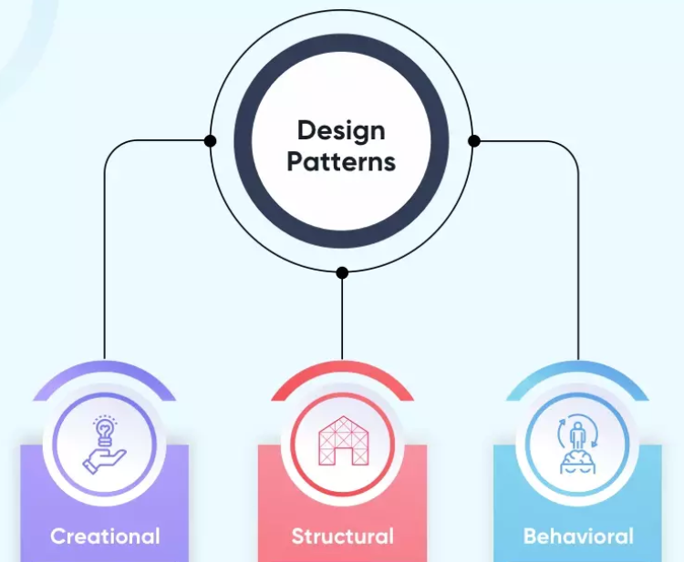

## Every Building Has a Blueprint

When an architect designs a building, they don't reinvent structural solutions from scratch every time. A load-bearing wall, a fire exit, a staircase — these are solved problems. Experienced architects know exactly how to handle them because those solutions have been tested, refined, and passed down across generations of construction.

Software development works the same way. Over decades of collective programming experience, developers noticed that certain structural problems kept reappearing across different projects. Their refined solutions became what we now call **design patterns** — reusable, named strategies for solving common problems in software architecture.

Design patterns are not copy-paste code snippets. They are conceptual blueprints: a shared vocabulary that lets developers communicate complex ideas quickly and build systems that are easier to maintain, extend, and understand. When a developer says "we used the Observer pattern here," every other developer on the team immediately knows what that means.

## Walking Through the Blueprint: Study Viser

Looking at my final project, Study Viser — a web application built with Next.js, React, Prisma, and PostgreSQL on NeonDB — design patterns are everywhere, even in places I didn't consciously think about while coding.

### The Component Pattern: Rooms in the Blueprint

The most visible pattern lives inside the `components/` folder. Files like `Navbar.tsx`, `Footer.tsx`, `BackButton.tsx`, `CourseItem.tsx`, `JoinCourseForm.tsx`, and `AddDefinitionForm.tsx` are self-contained UI building blocks — much like individual rooms in a building's floor plan.

This is the **Component Pattern**: breaking a user interface into independent, reusable pieces that can be composed together to build complex pages. Instead of one massive file handling everything, each component owns its own logic and appearance. Need a navbar on five different pages? Import `Navbar.tsx`. Need to display a course? Use `CourseItem.tsx`. The component pattern keeps code modular, readable, and easy to update.

### The MVC Pattern: Floors of Responsibility

Zoom out from the individual components, and the broader folder structure reveals another classic pattern: **Model-View-Controller (MVC)**. In Study Viser, this separation maps cleanly onto the project layout:

- **Model** — The PostgreSQL database managed through Prisma, which handles data storage and retrieval.
- **View** — The pages inside `app/`, such as `student-dashboard`, `courses`, and `instructor-dashboard`, which render what users actually see.
- **Controller** — The `api/` folder, which handles incoming requests, applies business logic, and communicates between the View and the Model.

This separation means that changing the database schema doesn't necessarily break the UI, and updating a page's visual design doesn't require touching backend logic. Each layer stays in its lane.

### The Provider Pattern: The Building's Central Utilities

One of the subtler — but most important — patterns in the project is visible in a single file: `providers.tsx`. This is the **Provider Pattern**, a React-specific implementation of a broader concept.

Think of it like a building's central utilities system. Rather than running individual water pipes to every room independently, a central system distributes resources to wherever they're needed. Similarly, `providers.tsx` wraps the entire application and supplies global state — such as authentication and session data — to any component that needs it, without requiring manual prop-drilling through every layer. Without this pattern, sharing user session information across `student-dashboard`, `instructor-dashboard`, and `auth` would become repetitive and fragile.

### The Observer Pattern: Automatic Reactions

Finally, underneath all the React components is the **Observer Pattern**, baked into React itself. Every time `useState` or `useEffect` is used, the Observer Pattern is at work. Components subscribe to pieces of state, and when that state changes, React automatically notifies and re-renders the affected components.

This is why, in Study Viser, updating a course list or a user's session triggers an immediate visual update across the app — no manual refresh required. The UI observes the data and reacts to it.

## A Vocabulary Worth Learning

Understanding design patterns changed how I read my own code. What once looked like a collection of files and folders now reads as a system of intentional, named architectural decisions. Component, MVC, Provider, Observer — each pattern is a solution to a recurring problem that someone else already solved, documented, and named so I didn't have to figure it out from scratch.

If someone asked me in an interview, "What are design patterns?", I'd tell them: they're the accumulated wisdom of experienced developers, packaged into reusable blueprints. And if they followed up with "Have you used any?", I'd point them straight to Study Viser.

### Use of AI
AI tools (Claude) were used to assist with structure, phrasing, and organization. The code examples, project context, and core ideas are based on my own work and experience during this semester.