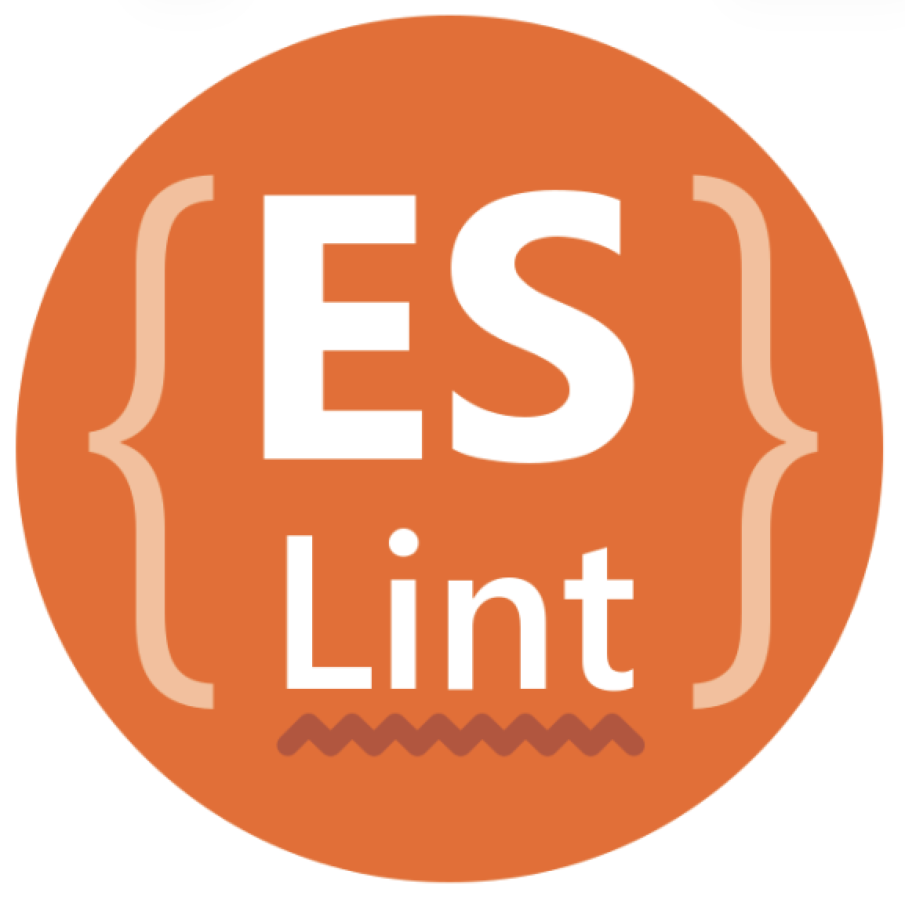

## Struggling with Coding Standards at First
At the beginning of the module, coding standards felt more frustrating than helpful. After writing code that worked, I often had to go back and fix numerous ESLint warnings and errors. Seeing red underlines appear immediately after finishing a function was distracting and sometimes discouraging. It felt like the tool was constantly pointing out flaws, even when the logic itself seemed correct.

This experience made coding feel slower. Instead of moving on to the next task, I had to pause and reconsider small details such as unused variables, explicit return types, or formatting rules. While I understood the intent behind these checks, the constant interruptions made the learning process feel more rigid and demanding.

## ESLint as a Source of Cognitive Load
One of the most challenging aspects was the mental overhead introduced by ESLint. Writing code while simultaneously anticipating potential linting errors required more attention than I was used to. Even minor mistakes immediately surfaced, forcing me to address them before continuing. This reduced my sense of momentum and made experimentation feel riskier.

However, this pressure also revealed gaps in my understanding. Many ESLint errors were not arbitrary; they highlighted unclear assumptions, weak typing, or inconsistent logic. Over time, I realized that the discomfort often came from confronting habits formed in more permissive coding environments.

## Recognizing the Value for Code Quality
As the module progressed, my perspective began to shift. Although fixing linting issues remained time-consuming, I started to see how coding standards could significantly improve overall code quality. The enforced consistency made code easier to read, even when revisiting it after some time. Decisions that once felt optional were now standardized, reducing ambiguity.

I also began to appreciate how these standards could prevent subtle bugs. Issues that might have gone unnoticed in a larger codebase were caught early, long before they could cause problems at runtime. This reinforced the idea that coding standards are not merely stylistic preferences, but tools for maintaining correctness and reliability.

## Coding Standards in Collaborative Environments
The real value of coding standards became most apparent when considering collaboration. In a team setting, consistent rules can reduce friction by establishing shared expectations. Instead of debating style or structure, developers can focus on logic and design. ESLint acts as a neutral enforcer, removing personal bias from code reviews.

This benefit becomes even more important in large-scale projects. When working with extensive codebases, small inconsistencies can accumulate and make maintenance difficult. Coding standards provide a common language that helps teams scale their efforts without sacrificing clarity or quality.

## Long-Term Perspective on Discomfort
Looking back, the discomfort I experienced seems like a necessary part of the learning process. Coding standards forced me to slow down, reflect, and write more intentional code. While the immediate experience was sometimes frustrating, the long-term benefits feel substantial.

This module helped me understand that professional software engineering prioritizes sustainability over speed. Although enforcing standards can be inconvenient in the moment, it ultimately supports better collaboration, higher quality, and more maintainable systems. That realization has changed how I approach writing code moving forward.

### Use of AI
AI tools (ChatGPT) were used to assist with organization, grammar, and clarity. The ideas and reflections presented in this essay are my own and are based on my personal experience during this semester.
