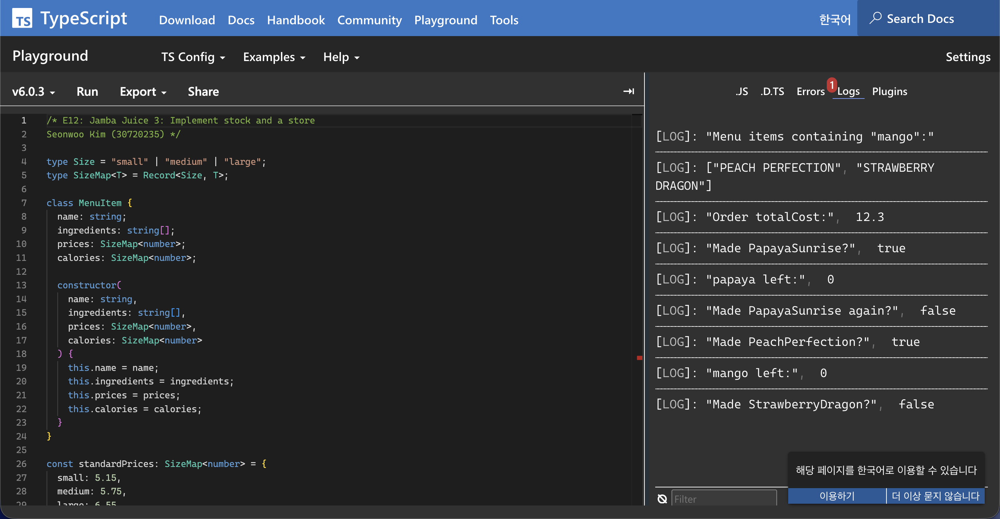

## Overview

This project is a TypeScript implementation of a simplified Jamba Juice store, developed as a series of incremental exercises in ICS 314. Starting from a basic menu representation, the system grows to support customer orders and, finally, live inventory management that prevents orders when ingredients run out. Each stage adds new classes and constraints on top of the previous one, simulating how real-world software evolves.

## What I Built

**Stage 1 — Menu modeling:** Designed a `MenuItem` class representing individual drinks with ingredients, prices by size, and calorie counts. Added a `Menu` class that stores items and supports ingredient-based search.

**Stage 2 — Order management:** Extended the system with a `Drink` class to represent a sized drink selection, and an `Order` class that manages multiple drinks and computes a running total cost.

**Stage 3 — Inventory constraints:** Introduced an `Inventory` class tracking available servings of each ingredient, and a `Store` class that decrements inventory as drinks are produced and rejects orders when stock runs out — modelling realistic operational constraints.

## What I Learned

This project was my first hands-on experience with TypeScript's type system at meaningful depth. Using union types to represent drink sizes, generics for flexible container types, and `Record` for ingredient tracking forced me to think carefully about data shapes before writing any logic. I also learned how to design classes that compose cleanly — each stage required extending existing code rather than rewriting it, reinforcing the value of forward-compatible design from the start.

Source: <a href="https://www.typescriptlang.org/play/?#code/PQKgBAogjATAXGAUgQwLYCNlIK4EsDGApmAMwICSqADgDaGqEB2ALmAM7MD2+A1mMowAm-dlwBOhAFABlQp0YB3TpzABpXKjAAKEgAYA7DF0wSAVgCUYEMEmTmATyrFpuAF7EAvGABEbVMhoabzAAHx8GQVxsVGCw7xpkMQBzQm8AbjtHZzdCAFlkKgAeABUAPjAvACVCfE4xQUKXdwAaMDKMyXwEtjYwXKZscmZ6MABvSTAwRjRCBA4xXEYkjMnFpIlIpmY2OeYFpYBtAF0VsCoFoh2wJryCwsZo9EIxUtP8ALrcQiub-KKHjDPV62Sa1RjzbD4cRaCaTKYzXb7JLNWGrJYbL4sK7zNbHFFws4Xb4IX53AFPF74uHvGifYnXHJ-e6PIGwyzjAnMAAWuDYADppgwKvCGKdJtzeXy1hitr0vNLCJssWKwBL+ecCN9hRrLiq1XyaXS5WBDQtvqcAL6SK2deQcUQCQSJQQABSJP0ZZJZL2FHPY-kCCFMfKgpipESiqCDfP0YdhCWSszAADY+aZTNaOmD7S6Csh7MhpNhGAs2J4poQFH0BkN6DDJt4XQBBZsATSb1wAqgA5SrkaQQbxUg7eKh5gtDnzzZAKClieyT0eEZD4LneI5UjiO51uzVsKmjf0BGgIKAATl0rQj0QQMAAHJewAmUggSHowFbzFm7awXcvV3+YgAGY1MwuDyMKjCVtWDy1qg9Y+C6EBNgAwgAEmASGVAAYhAKHFOQADy3ZDrCI5OCua6tN4-hLJwi7TrOzzzuum7MNu9S7pcB5HoGYAwFAj7XlGpBGK0z5JiQya6B+khfrY2asNIewznO9gACJiMgSQQV4UFVv0sHDPBsLeNIxSVE2ADqABCECVJUrZgOplkAOLEaRkzkbg7ETtRjFqYudQCCki5jj04GMEBYh4Mwi60Tpi6YNM0ysbCfqTH4x7RnecYEsJCCpjAeVwhJhV8rlVIWjxWV8VJQmKpGCAACwPuJiQvimgmyfJtrgkpKlMWI85WTyYg0JB0GGYMxkIWZFnWXZDlOVZaHkJUAAynlgCOAXMQu1HJQIyCLgUtCpBusJbkIO7ujVAYnvxglXo1N6kM9T4dZJD49Vm3S9NNYywhqABuyDDGAPn0Fc01wccwrHB0kzIIIgiw7NUMiej9DmAgIOcLgwgZaqPL8pj6rYGwXJaJj8mTDakxAYsaM1sZbA0+ijWyoiay4zBM30PDxOKRWip0MKCpKtsfJcBtnAKM8KHIGWWh03CEjMNgYiMCTkrk3yTM0MMYhaDTxmWB4pSonCmNSpzUv8mwnAMKbvMVOUawy5wcsK2ISsqxbHh6YQYuEOY1tq1aNpdMrvSaYsfB+gwRn0Ag2OoKcbA5CSOSnDqSbks8bwfGaVyF2ISMmj+MVQnUWjJwLWOs-QrRZ+4OfuOy1v6g3cHCr3xl6qTfJt+Wo9D5K+f983qB8vnbAHKPJzd8PppfMaA-0AaJfr4vOTL-T1oKf9YCEfUzxA5MoPg8Qgj7DwVzx4wPDw14iMgmAdSCM8T88Fod8JwQL-Pm+NCaXzhPqABz8KZU3-vfSOH8uDsRoChTgHBVYIHLuAyYGstY60gfffkGxISEFNmwaIrQoE8AtuUchmgADUYAqFzyJK0XQCDo4n3IIwEGWw6j2HAdfCGHBuA8DTncHESxWjl2BLCRSNdoSLB8rgAIylREIGqLUeohRJHIimN6UoXdOTDxEbwSaBkJF7DWNIgxqtK6MzqNoEWBxJaYmYK3Z4IM1hsCOJ-ICp90AACtQJ8i2KXDmyjVFcF4OYIxBJdaO2iTwEehBmAc3WFzFgXsfaK2VqQ8wHixBeKWGwNWh9D6whSMwWQRTvHpJlCwHmSw+ZYOJrg7WCSR5JL5FU+pmTmDZPlrkgOlgAD8oywC6EtB-LkysmzMA2suDghEoI1OKUkPpUsmlJD5ugZQdABDYLAO0-Bw8qlrLqa4rYlhyhTNhAzMAlNCArMIBcpYmy3HbN2fs5cOthY-jADwQgAj5T2zcYM32-t8kqhFvgLWEgWDCn1OczxdSgX2F6gSXA-itBwuGlsMAhQvDsOOakvBYAgIBDLPYzppjklljSei1oeKEWsAALRgCgGU0lmsOl7GwIQaZnDY7XHEMQP0ixeEsH4RQHhfD5yV3kZCRRcrpXzllVK8QGKjn6klfKkFkNVVaumXIgQ+QgX1xnmnGe3zOAHL+dbE5YBN6zyuViUJvD5yu2ae7a24ph56rVfYPksy2DzMWcrZgLy3kbN5hHE1kx-BAt-palOTc02t2zgyTuQD76hH0agTQxNsXaAAIT6neIwc1pCXWxKOTgslHSHiBBVA8xNM87YZIdgbOoEBKLep2e7etnTA1ar5E86NqL3m81bZi9Wjadb6WcvfVNjdM2dyFQpAFDdzH8zsZIBufIUYszTVoXMY4CxFhLLyMOGRD3HvTme-8XJAIgShJFeS97UaPuUlpIa85NLaXkJ+gYR7v0zy0L+1S+1Rq4HGr1EWCVOBwQ3qBpmQh07sxoiFei8lsx2sIHyWkGyADkgNyZVxYMgJRSxwg4e8HAEjeG7QEaI5wDZSGUN8n8FQV2NDIYChmLE78-VP7nzELus+38TYIYBVQqAu6U3nvzIWYspZCDUQkt4ZjomqEwEUyuv8lFX2gUitRYS2mOhf2eHyazYgU3yfknZ2z4mHP3xgLJ8ErHiNaG8FJi+SCAioI4HAScznAsoLQWk4TthgDADAGyxLkAoDNTaN8ZgCAk230IY8lguAJqHLdawGK4JP7YHZYlrdonR38N3dwzV-CtB+jHBe5Ap42J-rUreKkFFVzddhEh9rwMfIqaG5MYKSwkxQB67HSK0VYpjbAEdaY-XkZUHOkNi0nn7QiIkLutREgOYNfnNt1gggFNeF24RrLSnxyqevWWfyD1LN9SdnQNjGzvD5G-phO7V71OjMnOdsApag76MCDpt7hGfOjju0+QgQEMuThq-OHpqSY1YZayp7TX4wBxcmVV+0gh9OXbFdx5AybDN-bUzep7x4Xv4fezD77xBlOXpp2WfgSRqOMEB5Q-ToO9LYAh2kPH8XKU0DLITs7JBhRXfJ5ThOT7jPPDfWBeQ5nXoxEh959jvmWeYWfSZ998g+dMNl4L8HNAddM719hui8PEehdaCj4NKLaklN80hnHov8e6Gl0w1LpO6jXYp4QFNUH-0aS0jpRgmmvoM5Y7bz7BvI9qUA7Hs3ghUuW+bdb334uqWECAA"><i class="large github icon"></i>TypeScript Playground</a>
