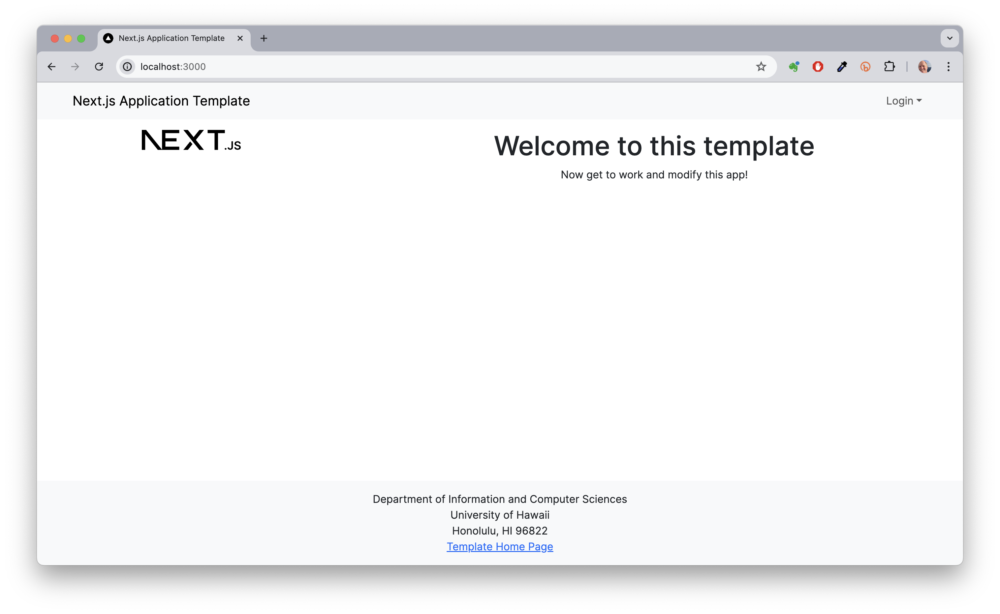
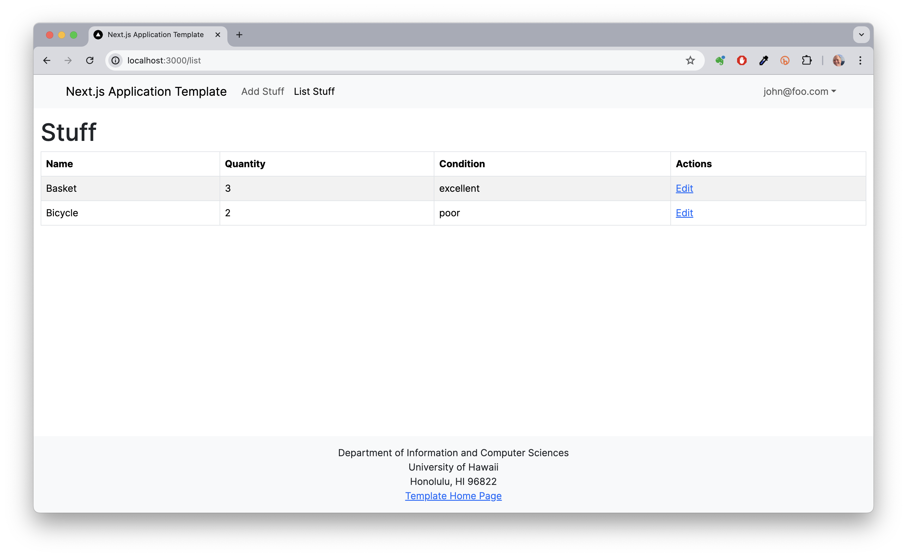
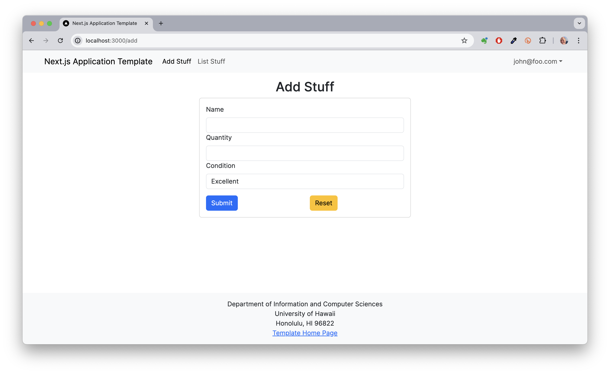
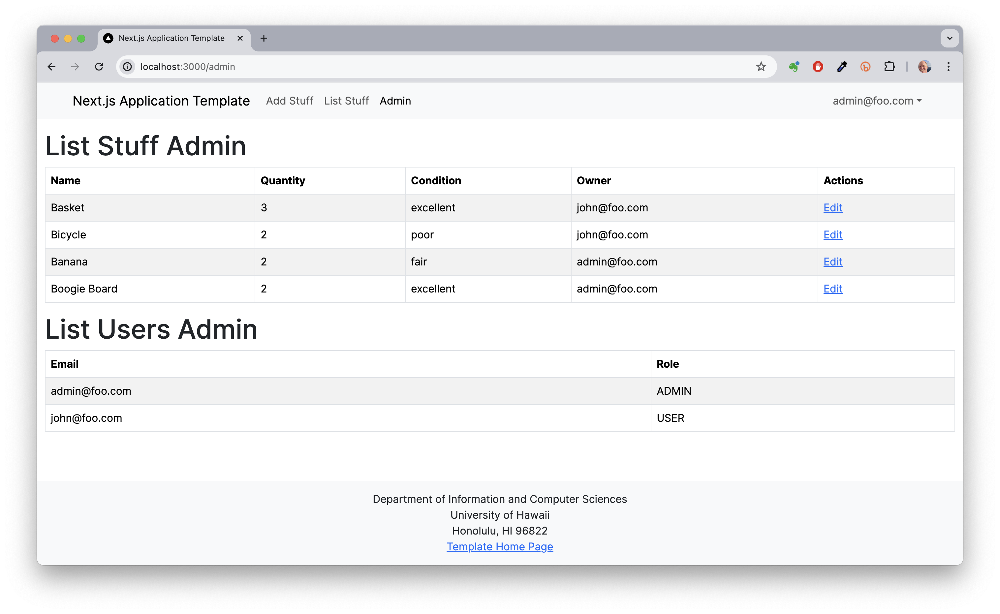

  

## Overview

Digits is a full-stack web application that allows users to track personal items — recording each item's name, quantity, and condition. The application supports multi-user access with authentication, so each user sees only their own data. An admin role provides a separate dashboard with visibility across all users and items.

The project was developed as part of the ICS 314 curriculum at the University of Hawaii at Manoa, progressing through a series of exercises that incrementally added pages, database integration, and access control.

**Tech stack:** Next.js 14, React, TypeScript, Prisma ORM, PostgreSQL, NextAuth.js, React Bootstrap.

  
  

## My Contributions

I implemented the full application individually as a guided exercise series:

- **Authentication system** — Configured NextAuth.js for credential-based sign-in, sign-out, registration, and password change, using a hashed password flow with Prisma.
- **Stuff CRUD** — Built the Add and List pages for creating and displaying a user's personal items, with form validation and server-side data fetching via Prisma.
- **Edit functionality** — Implemented the Edit page allowing users to update item details, with pre-populated form state pulled from the database.
- **Owner-based access control** — Enforced that each user can only view and modify their own items through session-based filtering on every database query.
- **Admin dashboard** — Built the admin-only page that lists all items across all users, protected by a role check on the session.

  

## What I Learned

Building Digits gave me a practical understanding of how authentication integrates with a database-backed application. Configuring NextAuth.js with a Prisma adapter required understanding the full session lifecycle — from credential validation at sign-in to session token propagation on each request. Implementing owner-based filtering taught me to think about data isolation as a first-class concern at the query level, not just at the UI level.

I also gained experience with server-side rendering in Next.js: fetching data on the server before the page renders, rather than through client-side API calls, which reduces loading states and keeps sensitive database logic out of the browser.

Source: <a href="https://github.com/kimseonw07/digits"><i class="large github icon"></i>kimseonw07/digits</a>
