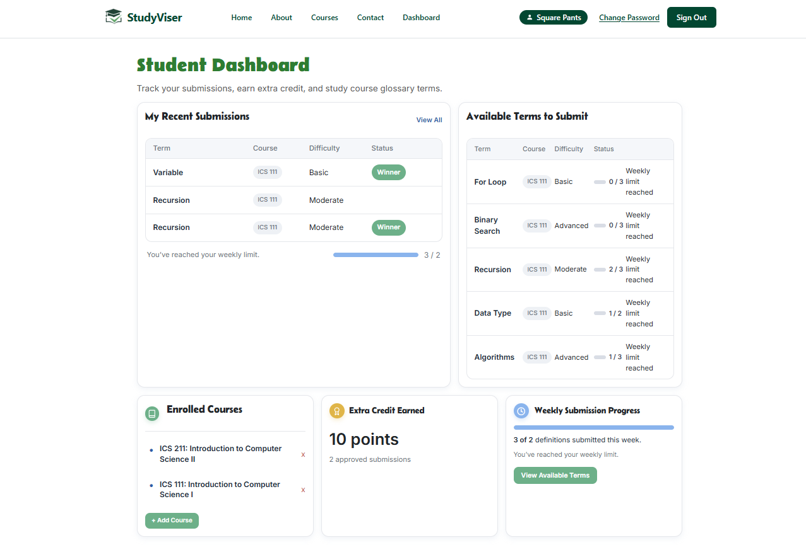
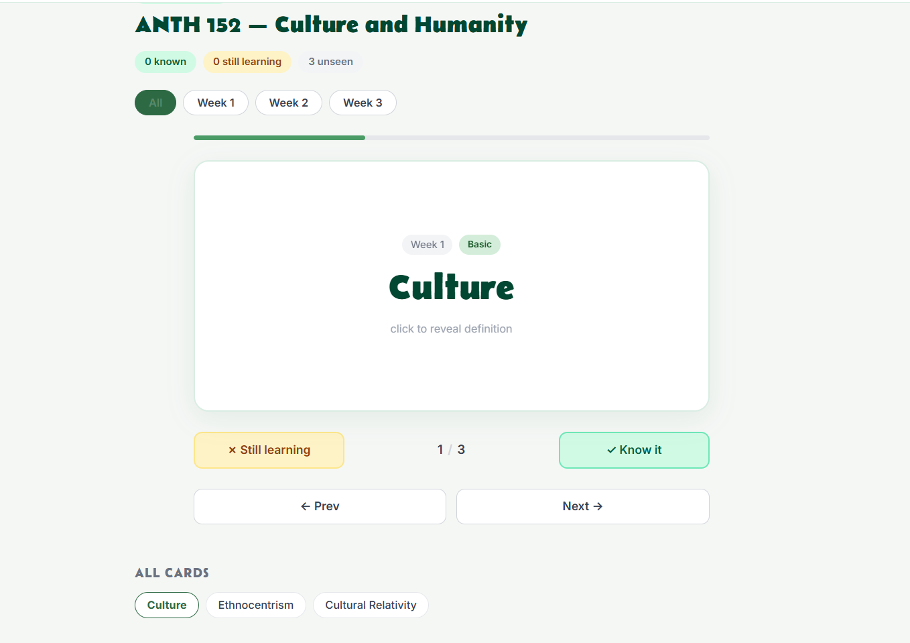

  

## Overview

StudyViser is a collaborative web application designed to help university students study more effectively by building and reviewing course-specific glossary terms. Students can join courses, contribute definitions, and browse a curated study guide for each course. Instructors can manage courses, monitor student activity, and organize term collections.

The application was built by a small team of three as the final project for ICS 314 (Software Engineering I) at the University of Hawaii at Manoa, Spring 2026.

**Tech stack:** Next.js, React, TypeScript, Prisma ORM, PostgreSQL (hosted on NeonDB), NextAuth for authentication, Tailwind CSS, Bootstrap.

  
  

## My Contributions

My primary contributions spanned UI design, front-end implementation, and database integration:

- **Student Dashboard** — Designed the initial mockup and implemented the deployed version, giving students a personalized landing page showing their enrolled courses and recent activity.
- **Instructor Dashboard** — Built the static layout for the instructor-facing dashboard, including course management controls and student overview panels.
- **Student Course Study Page** — Developed the static layout for the per-course study view, through which students access the glossary for a specific course.
- **Glossary Collation Feature** — Implemented the logic to aggregate and display glossary terms submitted by students across a course, organizing them into a browsable study guide.
- **Term View Page** — Built the individual term detail page, allowing students to view definitions, examples, and metadata for a specific glossary entry.

Throughout the project I tracked both coding and non-coding effort using a personal timer, and contributed estimates and actuals to the team's effort tracking spreadsheet.

## What I Learned

This project was my first experience building a full-stack application collaboratively from scratch under real project management constraints. Several things stood out:

**Agile workflow in practice.** Using GitHub Issues, project boards, and milestone-based planning (Issue Driven Project Management) gave the team a shared picture of progress without requiring constant synchronous communication. As an international student for whom English-language meetings can be cognitively demanding, the written, asynchronous nature of IDPM was genuinely valuable.

**Full-stack integration.** Connecting a Next.js front end to a Prisma-managed PostgreSQL database on NeonDB required understanding how data flows across the entire stack — from a user action in the browser down to a database query and back. Debugging that full path, across TypeScript types, API route handlers, and Prisma schema, deepened my understanding of each layer.

**Effort estimation.** Estimating task durations before starting and logging actual time afterward helped me realize how inaccurate my initial intuitions were, particularly for tasks that combined design and implementation. I now plan to decompose large tasks more aggressively before estimating.

Source: <a href="https://study-viser.github.io"><i class="large github icon"></i>studyviser-uhm (GitHub Organization)</a>
